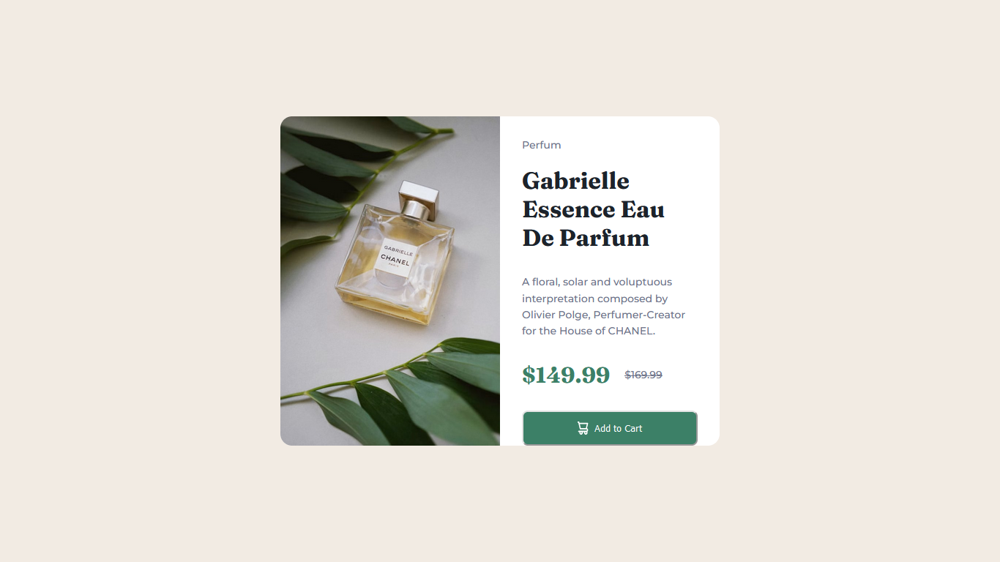
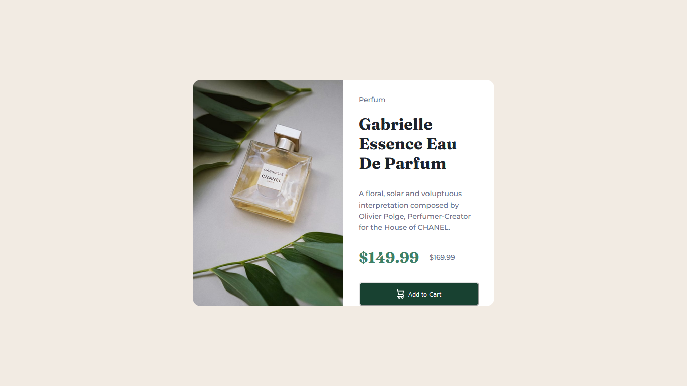
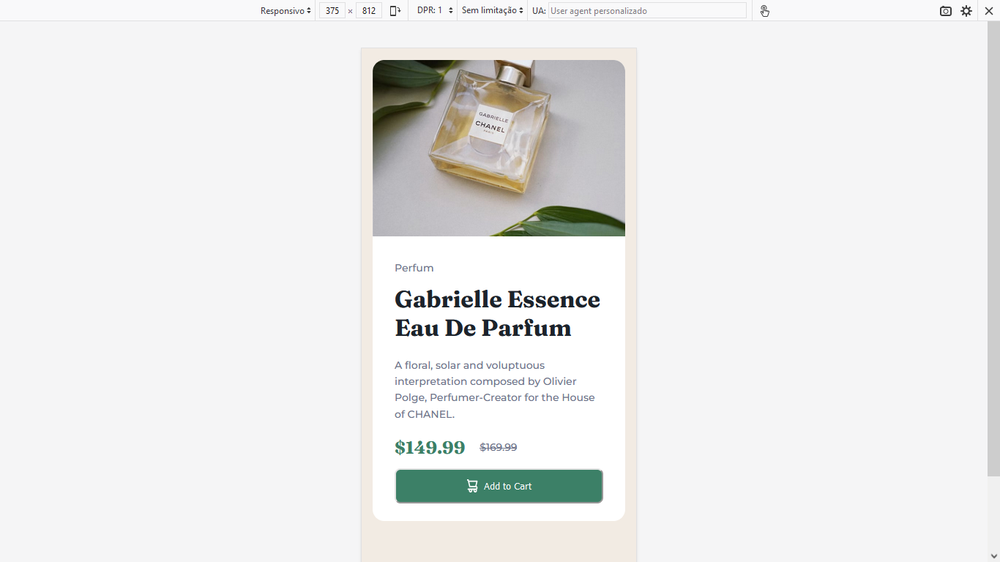
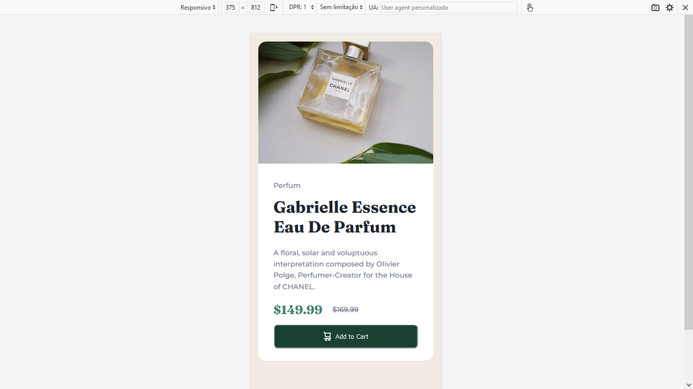

<h1>Desafio Frontend Mentor HTML CSS</h1>
 

Neste desafio foi utilizado apensa HTML e CSS. PArticularmente eu não iria fazer, mas como tem muitos desafios newbie no site, irei realizar todos. Assim irei praticar o máximo possível. 

 
<h2>Layout Desktop </h2>
 

 
<h2>Layout Desktop com hover no botão</h2>
 

 
<h2>Layout mobile</h2>
 

 
<h2>Layout no mobile hover no botão</h2>
 

 
<h3>Conclusões sobre o desafio</h3>
 

Desafio simples. Sem dificuldades. Utilizei picture para trocar a imagem quando a resolução do sispositivo vhega abaixo de 375px.
